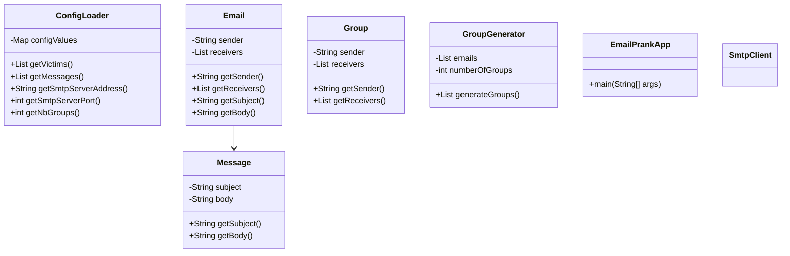
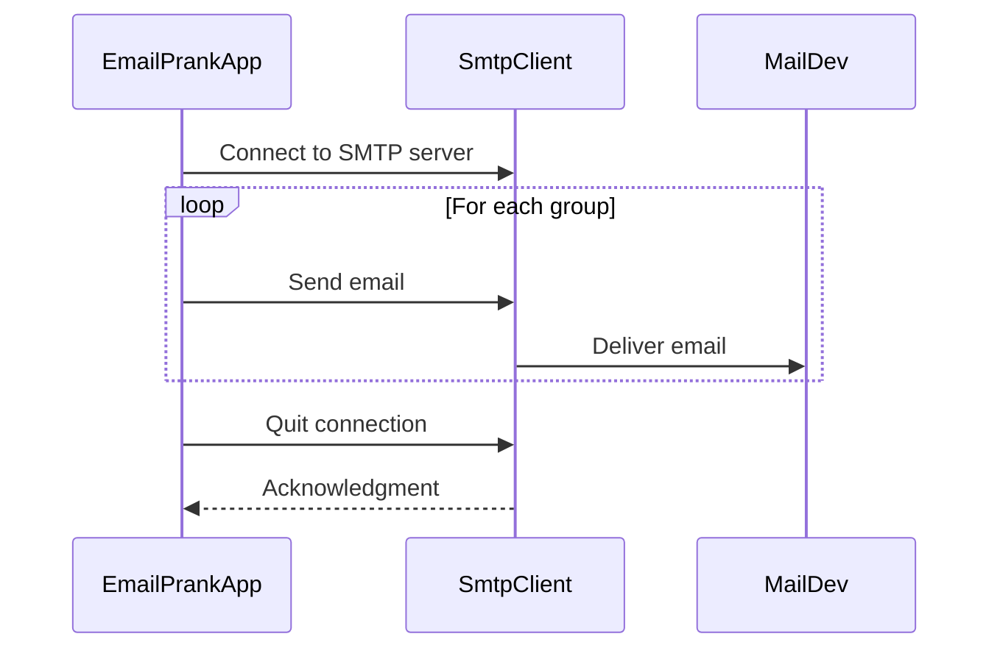

# Email prank application

This repository contains an email prank application designed for educational purposes. 
The tool generates prank email campaigns by dividing victims into groups and 
sending messages via an SMTP client.

## Table of contents

- [Email prank application](#email-prank-application)
    - [Table of contents](#table-of-contents)
    - [Project overview](#project-overview)
    - [Setup instructions](#setup-instructions)
        - [Prerequisites](#prerequisites)
        - [Setting up MailDev](#setting-up-maildev)
        - [Repository clone](#repository-clone)
    - [Running a prank campaign](#running-a-prank-campaign)
        - [Configuring the application](#configuring-the-application)
        - [Running the application](#running-the-application)
    - [Implementation details](#implementation-details)
        - [Class diagram](#class-diagram)
        - [Key components](#key-components)
        - [SMTP client interaction](#smtp-client-interaction)

## Project overview

This project is a Java application that automates the process of sending prank emails. 
Users can configure the number of groups, the email content, and the list of victims. 
The application ensures that each group has one sender and multiple receivers.

Features:

- Configurable via a single `config.txt` file located in the `config/` folder.
- Mock SMTP server support using MailDev for example in this case.
- Ensures valid email formats and balanced group generation.

## Setup instructions

### Prerequisites

1. Java 17 or later installed on your machine.
2. Docker to run the mock SMTP server.
3. (Maven to compile the application with the given `pom.xml)

### Setting up MailDev

To use a mock SMTP server for testing, run `MailDev` using `Docker`:

```bash
docker run -d -p 1080:1080 -p 1025:1025 maildev/maildev
```

- Web Interface: http://localhost:1080
- SMTP Server: localhost:1025

### Repository clone

```bash
git clone git@github.com:Anthony-Christen/dai-lab-smtp.git
# Or
git clone https://github.com/Anthony-Christen/dai-lab-smtp.git
```

```bash
cd dai-lab-smtp
```

## Running a prank campaign

### Configuring the application

Edit the `config/config.txt` file to specify the :

- **Victims file**: Name of the file containing the list of victim email addresses.
- **Messages file**: Name of the file containing prank email messages.
- **SMTP server address and port**: For example, use `localhost:1025` for testing with 
  `MailDev`.
- **Number of groups**: Define the number of groups for the prank campaign.

You will find an example of the expected config file with values in `config/config.txt`.

### Running the application

Compile the application with `Maven` (`.jar` file).
```bash
mvn clean package
```

Run the application
```bash
java -jar target/dai-lab-smtp-1.0.jar  
```

## Implementation details

### Class diagram

The following class diagram doesn't contain all the properties (attributes and 
methods), it's focused on the key aspects.



### Key components

#### ConfigLoader:

The `ConfigLoader` class is the backbone of the prank email application, as it manages 
the configuration settings required to run the program. It is responsible for reading 
and validating all the necessary parameters from the configuration file 
(`config/config.txt`) and ensuring they are ready for use. The configuration file 
includes details like the number of groups, SMTP server settings, and file paths for 
victims and messages.

Responsibilities:

- Load configuration: Parses the key-value pairs from the configuration file into 
a map for easy access.
- Validate Configuration: Ensures that all required keys are present and contain 
  valid values. For instance:
    + Numeric values, like the number of groups and the SMTP port, must be valid 
    integers.
    + Character encodings, such as UTF-8, must be recognized by the system.
    + All required file paths must be non-empty.
- Provide data: Offers  methods to access configuration values like the 
SMTP server address, victims email addresses, messages, and group settings.

#### GroupGenerator:

The GroupGenerator class is responsible for dividing the list of victim email 
addresses into balanced groups. Each group contains a sender and one or more 
receivers.

Responsibilities:

- Create groups: Distributes email addresses into groups such that each group has 
one sender and at least one receiver. The distribution is as balanced as possible.
- Validate input: Ensures there are enough email addresses to form the specified 
  number of groups, and that no group exceeds the maximum allowed size (e.g., 5 members per group).

#### Group

The `Group` class represents a group of emails in the prank email campaign. Each 
group consists of a single sender and a list of receivers, which are selected from 
the provided list of victims.

Responsibilities:

- Encapsulate group information: Stores the email address of the sender and a list 
of receivers for a specific group.
- Provide access to group data: Offers methods to retrieve the sender and 
  receivers of a group.

#### Email:

The Email class represents a complete email message, including the sender, receivers, 
and the message content (subject and body).

Responsibilities:

- Store email data: Holds the sender's email address, a list of receivers, and the 
associated message (`Message` object).
- Validation: Provides a utility method `isValid()` to check if an email address is 
  in a valid format (regex validation).

#### Message:

The Message class encapsulates the subject and body of an email. It provides an 
immutable structure to represent the prank messages that will be sent during the 
campaign.

Responsibilities:

- Store message content: Holds the subject and body of an email message.

#### EmailPrankApp:

The EmailPrankApp class serves as the entry point of the application. It orchestrates
the entire workflow of the prank campaign by coordinating configuration loading,
group generation, and email sending.

Responsibilities:

- Initialize components: Creates instances of `ConfigLoader`, `GroupGenerator`, and
  `SmtpClient`.
- Generate Emails: Calls the `generateEmails()` method to create a list of emails
  based on the groups and messages.
- Send emails: Sends the generated emails using the SMTP client.

### SMTP client interaction


